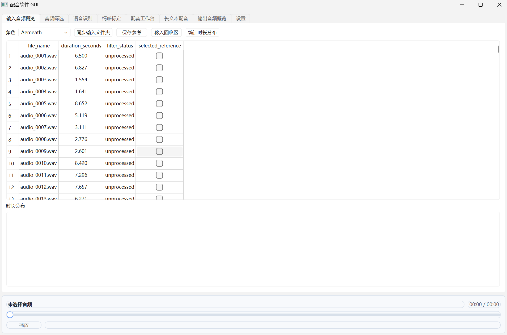
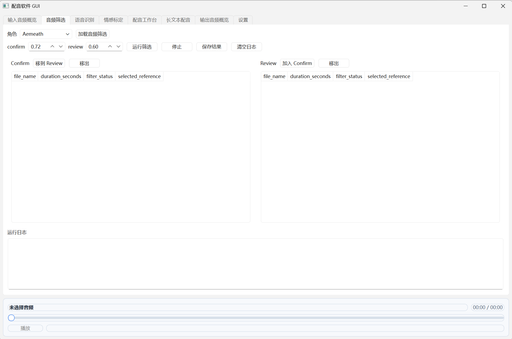
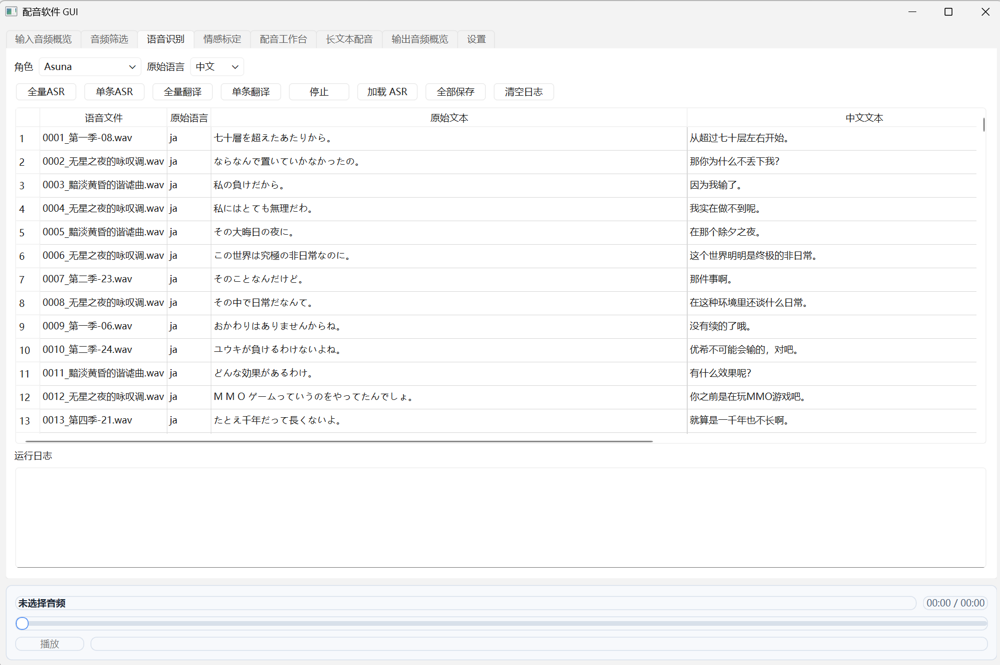
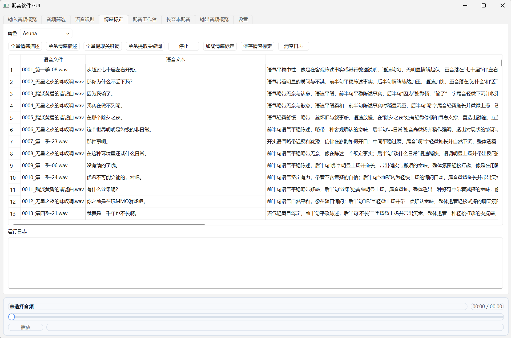
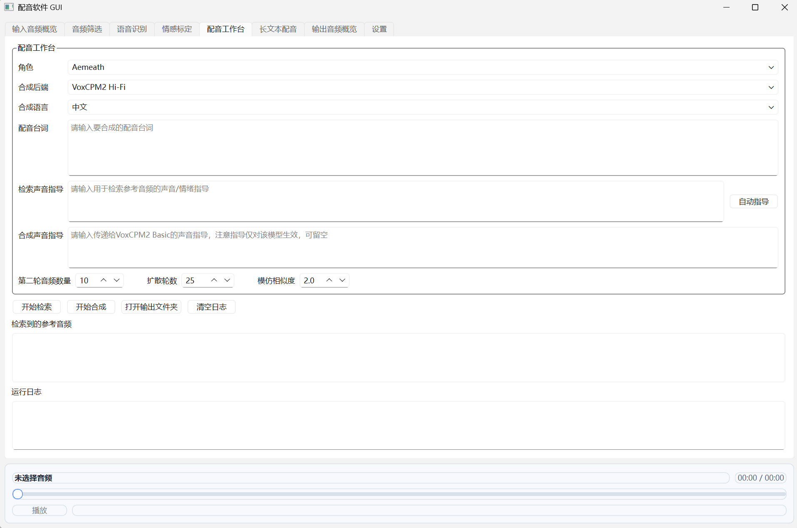
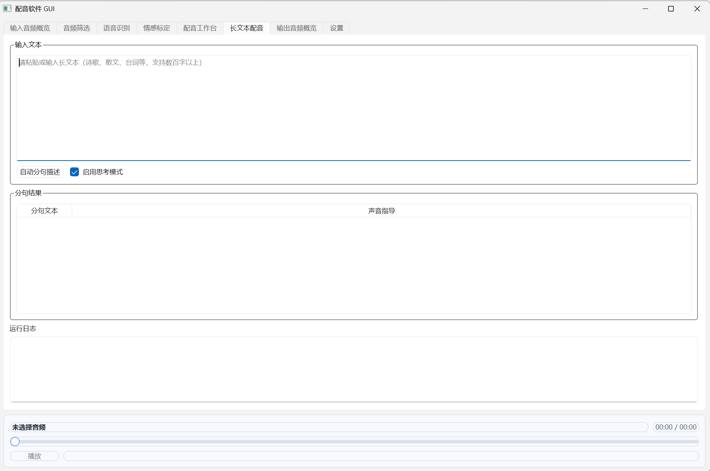
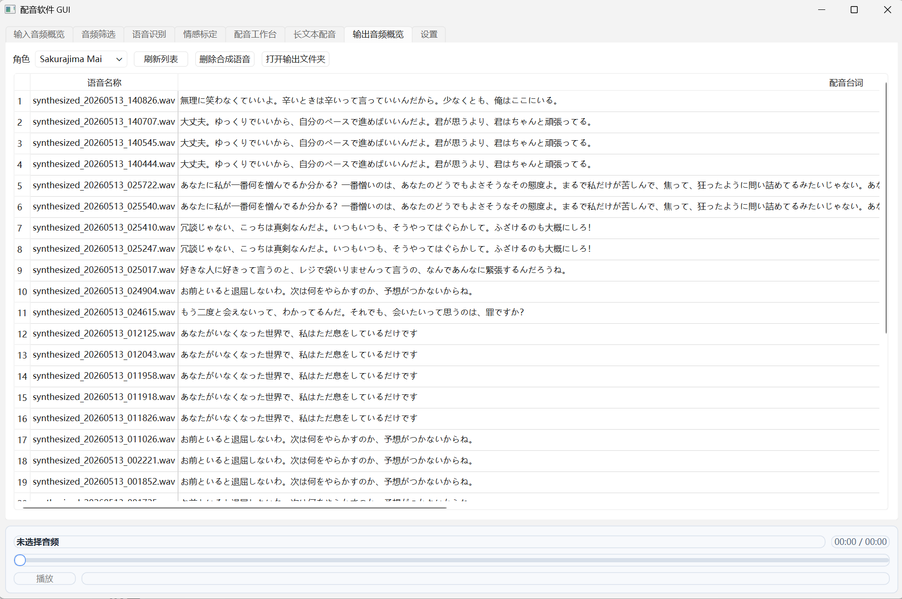
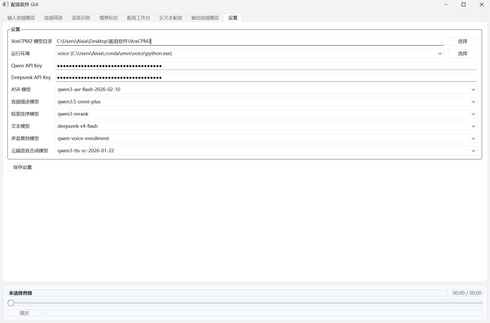

# 配音软件（Live-TTS）

> **简体中文** | [English](README.en.md)

一个面向角色配音的 AI 配音工作台：从原始音频素材出发，经过说话人筛选、语音识别、情感标定、参考音频检索，最终用云端 TTS 或本地 VoxCPM2 合成与目标台词、情绪匹配的配音。

项目采用 **PyQt6 桌面 GUI + Python 后端命令行**的架构，后端能力全部通过 `GUI/backend/workflow_cli.py` 以子进程方式调用，GUI 只负责展示、编排与交互，因此大部分能力也可以在纯命令行下使用。

---

## 功能特性

- **说话人筛选**：基于 CAM++ 声纹识别模型，以角色参考音频为质心，将原始音频自动分为 `confirmed / review / reject` 三档，快速筛出目标角色的声音素材。
- **语音识别（ASR）**：调用 Qwen3-ASR-Flash，支持中文、英语、日语，非中文台词自动翻译为简体中文。
- **情感标定**：Qwen3.5-Omni 多模态模型聆听音频并生成“导演式”自然语言语音描述，再由文本模型抽取结构化关键词（语气情绪 + 音频表达技巧），沉淀为角色语音库。
- **双层检索**：第一层用 `qwen3-rerank` 按关键词粗筛，第二层用文本模型（Qwen3.6-Flash / DeepSeek）综合描述与关键词做最终排序，选出与目标配音描述最匹配的参考音频。
- **双后端 TTS**：
  - 云端：Qwen 声音复刻（`qwen-voice-enrollment`）+ `qwen3-tts-vc` 语音合成；
  - 本地：VoxCPM2（basic 克隆 / hifi 克隆），无需联网，支持风格指导。
- **长文本配音**：LLM 按情感语气变化自动分句，并为每句生成声音表现关键词；双击分句即可跳转到配音工作台逐段合成。
- **自动指导**：输入台词后一键生成用于检索的声音/情绪关键词。
- **输出管理**：每次合成生成规范化的 `tts_runs` 目录（含 `run_summary.json`、参考音频/文本、合成音频），支持列表查看、删除、清理与文件名规范化。
- **历史数据迁移**：可将旧版目录结构（原始音频 / 参考音频 / 筛选音频 / 语音识别 / 情感标定等）与 Excel 角色库一键迁移到新的 `workspace` 体系。

---

## 界面预览

### 输入音频概览



将 `input_audio/<角色>/` 中的音频素材扫描进角色工作区，是整个流水线的起点。顶部工具栏提供：

- 角色下拉框 + 「同步输入文件夹」：按角色增量扫描音频（支持 wav / mp3 / m4a / flac / ogg，可含子目录）；
- 「保存参考」：把勾选的音频标记为目标角色参考音频（后续筛选与检索依赖它，至少需要 2 条）；
- 「移入回收区」：把误选或无效音频移入 `workspace/trash/`，不入库保留；
- 「统计时长分布」：按 0-2s / 2-5s / 5-10s / 10-15s / 15-30s / 30s+ 分段统计素材情况。

中间表格展示每个音频的文件名、时长、采样率、筛选状态与参考标记；下方为时长分布统计；底部播放器可试听任意选中音频。

### 音频筛选



基于 CAM++ 声纹模型，把候选音频与参考音频的质心比较，自动筛出目标角色声音。界面组成：

- 顶部：角色选择与「加载音频筛选」；
- 参数区：confirm 阈值（默认 0.72）与 review 阈值（默认 0.60），review 必须小于 confirm；
- 操作按钮：「运行筛选」「停止」「保存结果」「清空日志」；
- 结果区：Confirm / Review 双表并列展示，支持「移到 Review」「加入 Confirm」「移出」（excluded）手动纠偏；
- 底部：运行日志，显示处理进度与三档数量统计。

判定逻辑：`strong = min(质心相似度, 最高参考相似度)` 达到 confirm 阈值 → confirmed；`soft = min(最高参考, max(质心, 中位参考))` 达到 review 阈值 → review；其余 → reject。核对无误后点击「保存结果」写入 `audio_manifest.csv`，后续 ASR 只处理 confirmed 音频。

### 语音识别



调用 Qwen3-ASR-Flash 把 confirmed 音频转写为文本，并支持非中文台词翻译。界面组成：

- 顶部：角色选择与原始语言（中文 / 英语 / 日语）；
- 操作按钮：「全量 ASR」「单条 ASR」「全量翻译」「单条翻译」「停止」「加载 ASR」「全部保存」「清空日志」；
- 中间表格：语音文件、原始语言、原始文本、中文文本、ASR 错误、翻译错误，可直接编辑校对；
- 底部：运行日志，显示处理进度与 API token 用量。

中文音频识别结果直接作为中文文本；英语 / 日语音频先识别出原文，再通过翻译得到简体中文。结果确认后「全部保存」写入 `workflow_db.csv`（未保存前仅存在于表格预览）。

### 情感标定



为每条音频生成“导演式”语音描述与结构化关键词，沉淀角色语音库。界面组成：

- 操作按钮：「全量 / 单条情感描述」「全量 / 单条提取关键词」「停止」「加载情感标定」「保存情感标定」「清空日志」；
- 中间表格：索引、语音文件、语音文本、音频路径、自然语言描述、情绪语气、音频表达技巧、关键词，可手动编辑；
- 底部：运行日志，显示两步进度与 token 用量。

流程分两步：Step 1 用 Qwen3.5-Omni 多模态模型聆听音频并生成 50-150 字自然语言描述；Step 2 用文本模型从描述中抽取关键词（情绪语气 / 表达态度 + 音频表达技巧）。每次运行会在 `metadata/emotion_runs/` 留下 JSONL 记录与摘要，保存后写入 `workflow_db.csv`。

### 配音工作台



核心合成页面，流程为：输入台词 → 检索参考音频 → 勾选参考 → 合成配音。表单区包括：

- 角色与合成后端（`api` 云端 / `voxcpm2_local_basic` / `voxcpm2_local_hifi`）与合成语言（中文 / 英语 / 日语）；
- 「配音台词」：目标合成文本；
- 「检索声音指导」：描述希望的声音 / 情绪（如"温柔略带无奈"），旁边「自动指导」按钮可按台词一键生成关键词；
- 「合成声音指导」：仅对 VoxCPM2 Basic 生效，会以括号形式注入文本；
- 参数区：「第二轮音频数量」检索 top_k（默认 10）、「扩散轮数」与「模仿相似度」（VoxCPM2 的 inference_timesteps / cfg_value）。

下方为检索结果表格与运行日志。操作顺序：「开始检索」执行双层检索（rerank 粗排 → 文本模型终排）→ 在结果中勾选参考音频 → 「开始合成」；产物输出到 `output/tts_runs/<时间戳>/`，日志会打印所有路径与 token 用量。

### 长文本配音



用于数百字以上的长文本配音，把整段文本切分成适合逐句演绎的短句。界面组成：

- 输入区：粘贴或输入长文本（诗歌、散文、台词等）；
- 操作：「自动分句描述」按钮 + 「启用思考模式」勾选（Deepseek 对应 thinking，Qwen 对应 enable_thinking）；
- 结果区：分句结果表，两列为「分句文本」与「声音指导」；
- 底部：运行日志。

LLM 会按情感 / 语气变化将文本切分为 15-60 字的短句，并为每句生成 2-5 个声音表现关键词（保留原文、不删改）。**双击任一分句**即可跳转到配音工作台，自动填入该句与其声音指导，逐句检索合成。

### 输出音频概览



集中管理该角色的全部合成输出。表格列为：

- 语音名称：合成音频文件名（`synthesized_<时间戳>.wav/mp3`）；
- 配音台词：本次合成的目标文本；
- 检索声音指导文本 与 合成声音指导文本（仅 VoxCPM2 Basic 显示）。

支持的操作：双击 / 选中行试听，「打开输出文件夹」定位角色输出目录，「删除选中」删除对应 `tts_runs` 目录，「清理非规范目录」移除不符合命名规范的遗留目录，「统一文件命名」把旧版输出文件名与新规范对齐。每个运行目录还包含 `run_summary.json`、`retrieval_result.json`、参考音频 / 文本等完整产物。

### 设置



集中配置运行环境、密钥与模型，首次使用先在此页完成设置。配置项包括：

- **VoxCPM2 模型目录**：本地 TTS 权重所在目录，默认 `VoxCPM2`；
- **运行环境**：后端子进程使用的 Python 环境，自动扫描 conda / venv 目录，也可手动「选择」；
- **Qwen API Key** 与 **Deepseek API Key**：ASR、情感标定、检索与云端 TTS 需要；
- **模型下拉框**：ASR 模型、音频描述模型、检索排序模型、文本模型、声音复刻模型、云端语音合成模型，均可按需更换；
- 「保存设置」：写入 `voice_gui_settings.json`（已被 .gitignore 排除，不会上传）。

---

## 技术栈与模型

### 技术栈

- Python 3.12（打包环境使用 3.12）
- PyQt6 桌面界面
- 本地推理：PyTorch / torchaudio / modelscope / voxcpm
- 云端能力：DashScope（阿里云百炼，Qwen 系列）与 DeepSeek API
- 音频处理：soundfile / librosa / scipy / numpy
- 数据持久化：CSV（`audio_manifest.csv`、`workflow_db.csv`）+ JSON（运行摘要、缓存、运行记录）

### 依赖模型

| 用途 | 模型 | 运行位置 |
| --- | --- | --- |
| 说话人验证 | CAM++ `speech_campplus_sv_zh-cn_16k-common` | 本地（运行 `scripts/download_campplus.py` 下载） |
| 语音识别 | `qwen3-asr-flash` | DashScope API |
| 音频情感描述 | `qwen3.5-omni-plus` / `qwen3.5-omni-flash` | DashScope API |
| 检索重排 | `qwen3-rerank` | DashScope API |
| 最终排序 / 分句 / 自动指导 / 翻译 | `qwen3.6-flash` 或 `deepseek-v4-flash` / `deepseek-v4-pro` | DashScope / DeepSeek API |
| 云端声音复刻 | `qwen-voice-enrollment` | DashScope API |
| 云端语音合成 | `qwen3-tts-vc-2026-01-22` | DashScope API |
| 本地语音合成 | VoxCPM2（2B，30 语言，48kHz） | 本地（权重需自行下载） |

> 模型名称均可在 GUI「设置」页中修改，以上为默认值。

---

## 目录结构

```text
Live-TTS/
├── GUI/                        # PyQt6 桌面端
│   ├── main.py                 # 入口（支持 --smoke-test 自检）
│   ├── config.py               # 配置加载 / 保存 / 环境变量
│   ├── ui/main_window.py       # 主窗口：8 个功能页签 + 音频播放器
│   └── backend/workflow_cli.py # 后端命令行（GUI 以子进程调用）
├── code/voice_modules/         # 后端功能模块（可独立使用）
│   ├── audio_filter/           # 说话人筛选（CAM++）
│   ├── input_audio/            # 输入音频扫描 / 同步 / 时长统计
│   ├── common/                 # 音频清单、工作流数据库、迁移、状态
│   ├── speech_recognition/     # ASR 识别
│   ├── text_translation/       # 台词翻译
│   ├── emotion_labeling/       # 情感描述 + 关键词提取
│   ├── dubbing/                # 检索、TTS 合成、自动指导、输出概览、旧脚本
│   ├── long_text/              # 长文本分句 + 声音指导
│   └── role_library/           # 角色语音库
├── scripts/download_campplus.py  # CAM++ 说话人验证模型下载脚本
├── VoxCPM2/                    # 本地 TTS 模型目录（权重不入库）
├── build/VoiceDubbingGUI.spec  # PyInstaller 打包配置
├── requirements.txt            # Python 依赖
├── voice_gui_settings.example.json  # 配置模板
├── input_audio/                # 输入音频（本地数据，不入库）
├── workspace/                  # 角色工作区（本地数据，不入库）
└── voice_gui_runtime/          # GUI 运行期状态（本地数据，不入库）
```

---

## 快速开始

### 1. 环境要求

- Windows 10/11
- Python 3.12（建议）
- 使用本地 VoxCPM2 时：NVIDIA GPU + CUDA 12.8 驱动

### 2. 创建环境并安装依赖

```powershell
cd Live-TTS
python -m venv .venv
.\.venv\Scripts\activate
```

先按目标机器的 CUDA 情况安装 PyTorch（本仓库当前环境为 CUDA 12.8）：

```powershell
pip install torch==2.10.0+cu128 torchaudio==2.10.0+cu128 --index-url https://download.pytorch.org/whl/cu128
```

然后安装其余依赖：

```powershell
pip install -r requirements.txt
```

> 纯 CPU / 其他 CUDA 版本请到 PyTorch 官方索引选择对应的 wheel。

### 3. 配置 API Key 与运行环境

```powershell
$env:DASHSCOPE_API_KEY="你的 Qwen API Key"
$env:DEEPSEEK_API_KEY="你的 Deepseek API Key"   # 仅使用 Deepseek 排序模型时需要
```

也可以在 GUI「设置」页中填写并保存（会写入 `voice_gui_settings.json`，该文件已被 .gitignore 排除，切勿上传）。

### 4. 下载说话人验证模型（音频筛选必需）

说话人筛选依赖 CAM++ 声纹模型（Apache-2.0），模型文件不随仓库分发，请先运行下载脚本：

```powershell
python scripts\download_campplus.py
```

脚本会从 ModelScope 拉取模型（约 28MB，需联网）到 `code/voice_modules/audio_filter/speech_campplus_sv_zh-cn_16k-common/`，确认出现 `campplus_cn_common.bin` 等文件即就绪。

### 5. 启动

```powershell
python GUI\main.py
```

自检模式（打印窗口标题与角色列表后退出）：

```powershell
python GUI\main.py --smoke-test
```

### 6. 准备 VoxCPM2 本地模型（可选）

公开仓库只包含 VoxCPM2 的配置与 tokenizer 文件，**不包含权重**。需要使用本地配音时，将以下文件放入 `VoxCPM2/`：

```text
VoxCPM2/model.safetensors
VoxCPM2/audiovae.pth
```

仅使用云端 TTS 时无需下载。

---

## 使用流程

典型角色配音流程：

1. 启动 GUI，在「设置」页配置运行环境、API Key 与模型。
2. 将角色的原始音频放入 `input_audio/<角色名>/` 目录（可含子目录）。
3. 在「输入音频概览」页选择角色并「同步输入文件夹」。
4. 勾选 2 条以上目标角色参考音频，点击「保存参考」。
5. 在「音频筛选」页设置阈值并「运行筛选」，核对后「保存结果」。
6. 在「语音识别」页运行「全量 ASR」（非中文可再运行「全量翻译」），点击「全部保存」。
7. 在「情感标定」页运行「全量情感描述」与「全量提取关键词」，点击「保存情感标定」。
8. 在「配音工作台」页输入台词与检索声音指导，点击「开始检索」，勾选参考音频后选择合成后端「开始合成」。
9. 在「输出概览」页查看、试听与管理每次合成结果。

长文本请使用「长文本配音」页：粘贴文本 → 「自动分句描述」→ 双击某一句跳转到配音工作台合成。

---

## 命令行使用

后端能力独立于 GUI，通过 `workflow_cli.py` 暴露：

```powershell
python GUI\backend\workflow_cli.py --help
python GUI\backend\workflow_cli.py tts --help
```

所有命令均以 `VOICE_GUI_RESULT_JSON=` 前缀输出结构化 JSON 结果，便于脚本化调用。完整命令清单见 [docs/命令行工具.md](docs/命令行工具.md)。

---

## 打包为 exe

```powershell
pip install pyinstaller
python -m PyInstaller --noconfirm --clean --distpath . --workpath build\pyinstaller build\VoiceDubbingGUI.spec
```

打包完成后根目录生成 `VoiceDubbingGUI.exe`（GUI 以子进程调用后端，运行时仍需项目目录下的 `code/` 与模型目录）。

---

## 数据与隐私说明

软件运行会自动生成以下本地数据，均已在 `.gitignore` 中排除，**不要提交到 GitHub**：

```text
voice_gui_settings.json   # 本地配置（含 API Key）
voice_gui_runtime/        # GUI 运行期状态
workspace/                # 角色音频、元数据、输出
input_audio/              # 输入音频素材
```

详见 [docs/数据格式说明.md](docs/数据格式说明.md)。

---

## 常见问题

**Q：筛选时报“至少需要选择 2 条参考音频”？**

先在「输入音频概览」勾选至少 2 条目标角色音频并点击「保存参考」。

**Q：ASR / 情感标定 / 检索报缺少 API Key？**

在「设置」页填写 Qwen API Key（Deepseek 模型还需要 Deepseek Key），或设置同名环境变量。

**Q：本地 VoxCPM2 合成报模型目录不存在？**

确认 `VoxCPM2/model.safetensors` 与 `VoxCPM2/audiovae.pth` 已就位，并在「设置」页确认模型目录路径。

**Q：音频筛选报“模型目录不存在”？**

先运行 `python scripts\download_campplus.py` 下载 CAM++ 说话人验证模型，再重试筛选。

**Q：如何只使用云端 API？**

在配音工作台选择后端 `api`，无需下载 VoxCPM2 权重。

---

## 免责声明（AI 声音克隆合规）

本项目包含 AI 声音克隆（Voice Cloning）与语音合成能力，使用前请务必遵守以下要求：

1. **仅限合法用途**：只能用于你自己声音的克隆、已获得明确授权的他人声音、影视 / 游戏 / 有声内容等获得授权的配音制作，以及学习研究。
2. **禁止滥用**：严禁用于冒充他人、欺诈、诈骗、诽谤、传播虚假信息、深度伪造（deepfake）、未经授权模仿任何真实人物声音等任何非法或不道德用途。
3. **授权与合规由使用者负责**：使用本项目前，请确保你拥有所用音频素材的合法来源与授权，并遵守你所在国家 / 地区的法律法规以及所用模型与 API 服务（DashScope、DeepSeek、VoxCPM2 等）的服务条款。
4. **AI 生成内容标识**：公开传播 AI 生成的语音时，请按当地法律与平台规则标识为 AI 生成内容。
5. 项目作者不对使用者或第三方的任何滥用行为承担责任。

---

## 第三方许可与致谢

本项目基于并使用了以下开源项目与云服务，特此致谢：

| 项目 | 用途 | 许可证 / 条款 |
| --- | --- | --- |
| [VoxCPM2](https://github.com/OpenBMB/VoxCPM)（OpenBMB） | 本地语音合成（权重需从 `openbmb/VoxCPM2` 自行下载） | Apache-2.0 |
| [CAM++ 说话人识别模型](https://github.com/alibaba-damo-academy/3D-Speaker) | 说话人筛选（由下载脚本获取） | Apache-2.0 |
| [PyQt6](https://www.riverbankcomputing.com/software/pyqt/) | 桌面 GUI | GPL-3.0 或商业授权（Riverbank） |
| PyInstaller | exe 打包 | GPL-2.0 / GPL-3.0（含引导加载器例外） |
| PyTorch / torchaudio | 深度学习运行时 | BSD-3-Clause |
| ModelScope | 模型加载 | Apache-2.0 |
| numpy / pandas / soundfile / librosa / scipy / openpyxl / requests / openai / dashscope 等 | 通用依赖 | 各依赖自身许可证 |

云服务：

- **Qwen 系列模型**（`qwen3-asr-flash`、`qwen3.5-omni`、`qwen3-rerank`、`qwen3.6-flash`、`qwen-voice-enrollment`、`qwen3-tts-vc`）通过阿里云百炼 DashScope API 调用，使用须遵守阿里云服务条款。
- **DeepSeek API**（`deepseek-v4-*`）使用须遵守 DeepSeek 服务条款。

说明：

- 本项目代码本身以 MIT 许可发布；被引入的第三方组件仍受其自身许可证约束。
- 使用 PyQt6 打包并分发二进制时，请注意 PyQt6 的 GPL-3.0 义务，或购买 Riverbank 商业授权。

---

## 文档

- [使用手册](docs/使用手册.md)：GUI 各页签的详细操作说明
- [架构说明](docs/架构说明.md)：模块职责、数据流与 workspace 结构
- [命令行工具](docs/命令行工具.md)：workflow_cli 全命令参考
- [数据格式说明](docs/数据格式说明.md)：CSV / JSON 数据格式与字段含义
- [开发指南](docs/开发指南.md)：环境搭建、代码组织、打包与提交规范

## License

[MIT](LICENSE)
