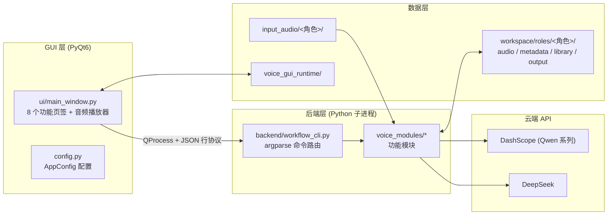
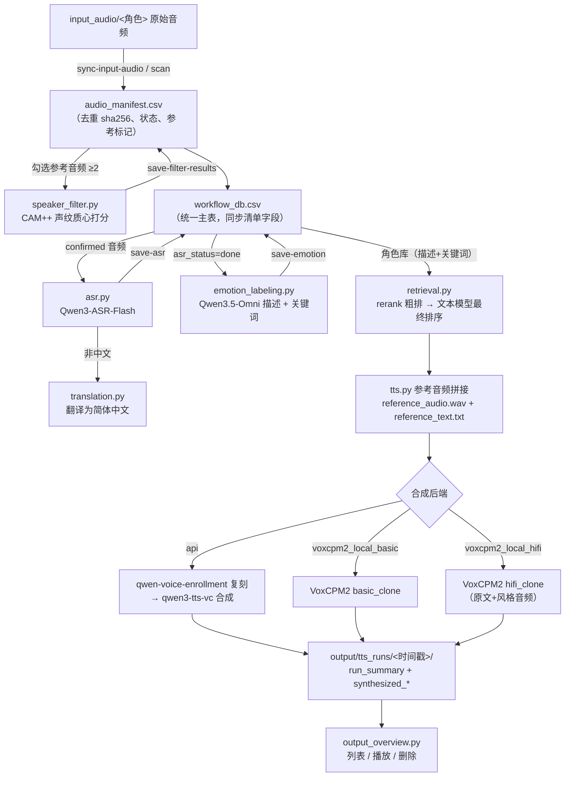

# 架构说明

## 总体架构

项目是 **PyQt6 GUI + 后端命令行（subprocess）** 的两层结构：



### 通信协议

- GUI 用 `QProcess` 启动 `python GUI/backend/workflow_cli.py <子命令>`，传入参数文件路径。
- 后端向 stdout 输出进度日志，最终结果以一行 `VOICE_GUI_RESULT_JSON={...}` 前缀 JSON 返回。
- 表格预览数据（ASR / 情感 / 筛选 / 检索）先落在 `voice_gui_runtime/*.json`，由 GUI 加载展示；用户确认「保存」后才正式写入 workspace 的 CSV。

---

## 模块职责

### GUI 层

| 文件 | 职责 |
| --- | --- |
| `GUI/main.py` | 入口，支持 `--smoke-test` 自检；冻结环境自动修正路径 |
| `GUI/config.py` | `AppConfig` 数据类：读取/保存 `voice_gui_settings.json`，注入环境变量 |
| `GUI/ui/main_window.py` | 主窗口：输入音频概览、音频筛选、语音识别、情感标定、配音工作台、长文本配音、输出概览、设置 |
| `GUI/backend/workflow_cli.py` | 后端命令路由（argparse），每个命令对应一个功能模块调用 |

### 后端模块（`code/voice_modules/`）

| 模块 | 关键文件 | 职责 |
| --- | --- | --- |
| `common` | `audio_manifest.py` | 音频清单（CSV）、角色目录、sha256、去重导入、回收区 |
| `common` | `workflow_db.py` | 统一工作流主表（CSV）：筛选 → ASR → 翻译 → 情感 → 角色库全字段 |
| `common` | `workspace_migration.py` | 旧版目录结构与历史 CSV 迁移 |
| `common` | `legacy_excel_import.py` | 从历史 Excel 角色库导入音频与标注 |
| `common` | `project_state.py` | 项目/角色状态扫描（GUI 启动加载） |
| `audio_filter` | `speaker_filter.py` | CAM++ 说话人筛选（confirmed/review/reject 打分） |
| `input_audio` | `input_audio.py` | 输入目录扫描、增量同步（缓存）、时长分布 |
| `speech_recognition` | `asr.py` | Qwen3-ASR-Flash 识别 + 重试/用量统计 |
| `text_translation` | `translation.py` | 台词翻译为简体中文 |
| `emotion_labeling` | `emotion_labeling.py` | 多模态情感描述 + 文本关键词提取 |
| `dubbing` | `retrieval.py` | 双层检索（rerank + 最终排序） |
| `dubbing` | `tts.py` | 参考音频拼接、声音复刻、云端/本地合成、缓存 |
| `dubbing` | `auto_guidance.py` | 从台词生成检索声音指导关键词 |
| `dubbing` | `output_overview.py` | tts_runs 输出目录规范化、列表、删除 |
| `dubbing` | `legacy_scripts/` | 旧版命令行脚本（保留兼容，新功能勿用） |
| `long_text` | `sentence_splitter.py` | 长文本分句 + 每句声音指导 |
| `role_library` | `role_library.py` | 角色库数据加载 / 保存 / 路径解析 |
| `audio_organizer` | `audio_organizer.py` | 预留：音频整理（后续版本接入） |

---

## 核心数据流



---

## workspace 结构

```text
workspace/
├── roles/
│   └── <角色>/
│       ├── audio/raw/                # 去重导入的原始音频（硬链接或复制）
│       ├── metadata/
│       │   ├── audio_manifest.csv    # 音频清单（筛选状态、参考标记、声纹分数）
│       │   ├── workflow_db.csv       # 统一主表（ASR/翻译/情感/角色库）
│       │   ├── input_scan_cache.json # 输入目录增量扫描缓存
│       │   └── emotion_runs/         # 情感标定运行记录（jsonl + 摘要）
│       ├── library/
│       │   └── 情绪关键词.xlsx       # 角色语音库（旧版兼容产物）
│       └── output/
│           ├── tts_runs/             # 每次合成的规范化目录
│           ├── tts_retrieval_cache/  # 检索结果缓存
│           ├── voice_cache.json      # 云端声音复刻指纹缓存
│           ├── voxcpm2_prompt_cache.json
│           └── voxcpm2_prompt_cache/ # VoxCPM2 prompt 缓存（.pt）
└── trash/                            # 移入回收区的音频（按时间戳归档）
```

角色名支持别名归一化：`moning/morning/m/1 → 莫宁`，`yuno/younuo/y/2 → 尤诺`。

---

## 缓存与去重机制

- **音频去重**：`import_audio_file` 按文件 sha256 生成 `原名_sha256前10位.扩展名` 存储，避免重复导入；同哈希行更新状态而非新增。
- **云端声音复刻缓存**：参考音频字节 + 参考文本 + 目标模型 + 语言的 sha256 指纹，`voice_cache.json` 记录已创建的 voice 名称，避免重复调用复刻接口。
- **VoxCPM2 prompt 缓存**：参考音频 + 文本 + 模型路径 + 模式（+ 风格音频/文本）指纹，`voxcpm2_prompt_cache/*.pt` 缓存构建好的 prompt cache，加速重复合成。
- **输入扫描缓存**：按路径 + size + mtime 判断增量，避免重复扫描。

---

## 模型选择与 Token 用量

- 所有云端调用都通过 OpenAI 兼容协议或 DashScope SDK，日志会输出每次运行的 token 用量（ASR / 情感 Step1 / 关键词 Step2 / rerank / 最终排序 / 复刻 / TTS）。
- 文本类任务（最终排序、翻译、分句、自动指导、关键词）支持 `qwen3.6-flash` 与 `deepseek-v4-*`，代码按模型名前缀自动路由到对应供应商与密钥。

---

## 目录：为什么 GUI 与后端分离

1. 长任务（筛选、批量 ASR、批量情感标定）在子进程中运行，GUI 不阻塞、可随时「停止」。
2. 后端输出结构化 JSON，既服务 GUI，也可被脚本直接调用与自动化。
3. 打包时只需把 GUI 打进 exe，后端模块与模型保留在项目目录，便于独立升级。
